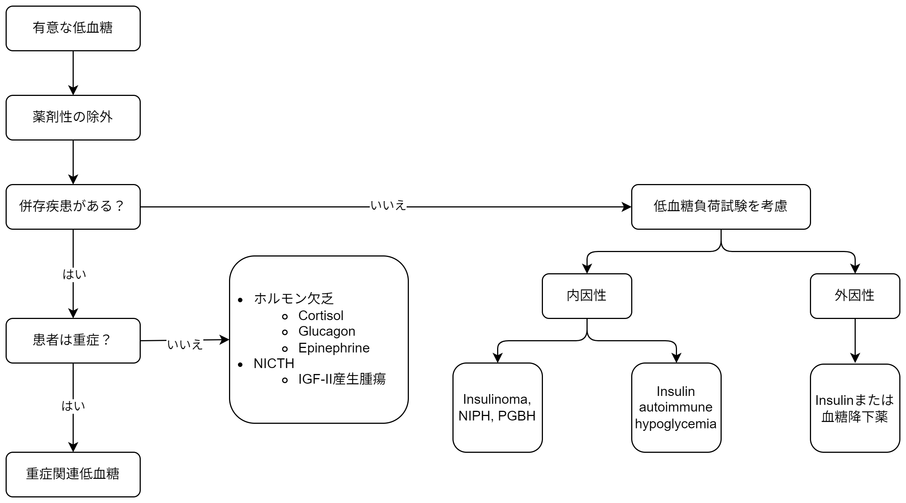

## Agenda

1. 症例
1. 低血糖！とくらいつく前に・・・・・・
1. Hypoglycemia without DM
1. 低血糖のModernな分類
1. Fitting wellの場合
1. 低血糖の検査の考え方～低血糖の各種の検査～

## 症例

* 78歳男性
* 繰り返す低血糖で入院
* 食事摂取低下後の低血糖で入院 →退院後に低血糖によるCPAで救急科入院 →総合内科添加後も低血糖を繰り返した・・・・・・

## 低血糖！とくらいつく前に・・・

- 本当に意味のある低血糖？
- 低血糖の定義
- Whippleの3徴を確認する
    - Symptoms consistent with hypoglycemia
        - 自律神経症状: 振戦、動悸、不安/興奮、発汗、空腹感、
        - Neurogycopenic symptoms: めまい、脱力、意識障害
    - 有症状時に通常の採血で血糖値< 55mg/dLが証明されている
    - 血糖値が改善したら症状も改善する
- 若年女性だと絶食期間があると無症状の低血糖になる事は多い

## 具体的な症状 

- Insulinomaで多い症状
    - 77%が自律神経症状、96%が神経症状(>= 80%が混乱・異常行動, 50%が意識消失、12-19%が痙攣発作)
- 症候性
    - 65 mg/dL未満で症状があればほぼ有意
    - 65-79 mg/dLの場合は通常は低血糖によるものではないが、否定は出来ない
    - 80 mg/dL以上だと症状の原因にはならない
- 無症候性
    - 40 mg/dL未満は有意: 繰り返す低血糖で症状が出なくなっている可能性
    - 40-64 mg/dL: 患者背景で考える

## 低血糖の考え方

- 栄養不良や吸収不良による低血糖は稀
- 血糖を上げるホルモンと下げるホルモンで考えると良い
- 血糖を上げるホルモン(が少ない)
		- 甲状腺ホルモン
		- Glucagon
		- Adrenaline
		- GHなど
- 血糖を下げるホルモン(が多い)
		- Insulin
		- Insulin likeなホルモン(IGF-2など)

## ただし・・・・・・

- 下記理由から、この考え方よりはより実践的な考え方がある

## 低血糖の診断 at glance

* 真の低血糖を確認したら2種類に分ける

## Hypoglycemiaの問診

* 詳細な病歴
    * いつ・どんな症状が出る？誘発因子は？
    * 薬は？
        * OTC、漢方薬も含めて確認する

## 低血糖のModernな分類
- 昔は、空腹時と食後で分類していた
    - この区別は現在では有用性が低いことが知られている
        - 患者が自覚できない事もちゃんと病歴を述べられないことも多い
- 現在では以下のように分ける
    1. 内服中または内科疾患が明らかにある患者(Ill or medicated)
    1. 健康(そうに見える)患者(Seemingly well)

## 低血糖の鑑別 ~ Ill or medicated individual {.smaller}

1. 薬剤性
    - Insulin or insulin分泌促進薬
    - アルコール
1. 重症患者(Critical illnesses)
    - 肝/腎/心不全
    - 敗血症 (malariaを含む)
1. 内分泌疾患(ホルモン分泌不全)
    - 副腎不全(Cortisol分泌不全)
    - グルカゴン・ノルアドレナリン分泌不全^[Insulin分泌不全の糖尿病患者において、下垂体疾患などによる甲状腺機能低下やGH低下で低血糖になりやすい] 
1. Nonislet cell tumor

## Nonislet cell tumorについて

-   膵臓以外の腫瘍による低血糖
-   機序として複数あり
    -   IGF2を産生する事によりInsulinomaのような病態になる
    -   悪性腫瘍自身が血糖を消費する　など

## Ill or medicatedについて

* 重症患者の場合はしばしば低血糖になる
    * 食事量低下+(肝臓/腎臓での)糖新生の低下+Insulinのclearanceの低下
    * Sepsis, 肝/腎不全
    * この場合、色々な検査はあまり有用性は低く原病の治療が重要
    * そうであっても、副腎不全の検査の閾値は低くする
* Nonislet cell tumorはIGF2産生腫瘍によりInsulinomaのようになる疾患
    * 殆どは肝細胞癌で腫瘍は巨大である

## 低血糖の鑑別 ~ Seemingly well {.smaller}

1. 内因性の高インシュリン血症
    - Insulinoma
    - 機能性Β細胞疾患(Functional beta cell disorders; nesidioblastosis)
        - Noninsulinoma pancreatogenous hypoglycemia (NIPHS)
        - Post-gastric bypass hypoglycemia
            - Gastric bypass or Nissen手術後の食後低血糖
    - インシュリンへの自己免疫関連(Insulin autoimmune hypoglycemia)
        - 抗Insulin抗体^[自己抗体が外れた時に低血糖になる]
        - 抗Insulin受容体抗体^[Insulin受容体への自己抗体が受容体を活性化させる] 
    - Insulin分泌促進薬
    - その他
1. 偶発的、あるいは故意による低血糖

## NIPHSについて

- 膵島細胞の過形成および、Lngerhans細胞への分化による稀な低血糖の原因
- 食後2-4時間で低血糖が起こることが特徴
- The predominant clinical feature of noninsulinoma pancreatogenous hypoglycemia syndrome (NIPHS) is postprandial hypoglycemia with adrenergic (eg, tachycardia, tremor) and neuroglycopenic (eg, confusion, seizure, or dysarthria) symptoms. Patients may have neuroglycopenic symptoms without adrenergic symptoms.
- 内因性の高Insulin血症

## PGBHについて

- 

## Insulin autoimmune hypoglycemiaについて

## Seemingly well individual

* 簡単に言うと「きれいな原因の疾患」が隠れている
* インシュリン関連の検査をしつつ、
* **頑張って低血糖時の採血**をとりに行く！

## 薬を考慮

| Evidenceレベル    |                                   薬剤名　　　　　　                                          |
| ---------------- | :-------------------------------------------------------------------------------------------: |
| Moderate quality |   Cibenzoline, Gatifloxacin, Pentamidine, Quinine, Indomethacin, Glucagon during endoscopy   |
| Low qualtiy      | Chloroquineoxaline sulfonamide, Artemisin, IGF-1, Lithium, Propoxypherene/Dextropropoxyphene |

* Quinolones, Pentamidine, Quinine, BB, ACEi, IGF-1が有名
* Very low quality of evidenceは割愛

## 低血糖の検査の考え方～低血糖の各種の検査～

* Insulinの分泌能をみる検査
    * ProInsulin
    * 血清C-peptide
* Insulinが分泌していないのに血糖が低いときの検査   = 脂肪酸代謝になっている
    * 血清ケトン体

## 検査結果の解釈{.smaller}

|            疾患名             | Insulin (microU/mL) | C-peptide (nmol/L) | Proinsulin (pmol/L) | βヒドロキシ酪酸 (mmol/L) | insulin自己抗体 |
| :---------------------------: | :----------------: | :-----------------: | :-----------------: | :--------------------: | :-------------: |
|         外因性insulin         |         >>3         |        <0.2        |         <5          |           ≤2.7           | 陰性 (時に陽性) |
|    Insulinoma, NIPHS1, PGBH2    |         ≥3          |        ≥0.2        |         ≥5          |           ≤2.7           |      陰性       |
|          血糖降下薬           |         ≥3          |        ≥0.2        |         ≥5          |           ≤2.7           |      陰性       |
|        Insulin自己抗体        |         >>3         |       >>0.2        |        >>5         |           ≤2.7           |      陽性       |
|           IGFによる           |         <3          |        <0.2        |         <5          |           ≤2.7           |      陰性       |
| Not insulin (or IGF)-mediated |         <3          |        <0.2        |         <5          |           >2.7           |      陰性       |

1. NIPHS: noninsulinoma pancreatogenous hypoglycemia syndrome
2. PGBH: post-gastric bypass hypoglycemia

## Point 

* Insulin ≧3 μU/mLはInsulinによる低血糖を示唆する
* C-peptide, ProInsulinはInsulinが内因性か外因性かを判断する
    * Insulinによる低血糖の時に、C-peptide <0.2nmol/L(0.6 ng/mL)は外因性のInsulin
    * ProInsulin <5 pmol/Lは外因性のInsulinを示唆する
    * ProInsulin, C-peptideが高いと悪性腫瘍を示唆し、Proinsulinが高値なほど未分化
* βヒドロキシ酪酸はInsulinまたはIGFによる低血糖では抑制される  = 陽性の場合はInsulinやIGFによる低血糖は否定的で、Cortisol欠乏、慢性の低栄養、肝腎不全、薬剤性など

## UptoDateのアルゴリズム

1. 副腎不全を否定する
2. アルコールや薬などの低血糖Riskの確認
3. Bariatric surgery, Insulinや血糖降下薬のアクセス、悪性腫瘍の既往
4. medicated or illと判断

## Dynamedのアルゴリズム

## 勇気を持って

* Insulin/IGFによる低血糖疑い or 原因がわからない時に**誘発試験**の適応
* 絶食試験あるいはMixed-meal test(食後5時間以内に発症)で低血糖を誘発
* 低血糖の時に採血を行う
    * 血糖値
    * Insulin値
    * 血清C-peptide
    * 血清βヒドロキシ酪酸(aka ケトン体)
    * プロインシュリン値
    * (血糖降下薬のスクリーニング)

## 絶食試験のやり方 

1. AM 8時に絶食開始
1. カロリー/カフェインフリーの飲み物のみ摂取可
1. 2hr毎に血糖測定
1. 70mg/dL未満になったら、30min毎に症状確認と血糖測定
1. 72時間経過あるいは<55mg/dLまたは無症候でもBS< 45 mg/dLを達成したら修了
1. BS< 55 mg/dLの時の採血を行う
1. Glucagon 1mg ivし10, 20, 30min後の血糖測定
    * Glucagon iv後にGluが25 mg/dL以上改善したらInsulin性低血糖を示唆する

## 検査の解釈

* 閾値は通常と異なること二注意
* 低血糖時の検査の閾値での結果はInsulinomaに対して感度>90%, 特異度>70%

## Take home message

* 低血糖を見た時には、Whippleの三徴で真の低血糖かを確認する
* 低血糖は**seeming well**か**medicated or ill**で鑑別する
* 低血糖の原因はInsulin関連かInsulin以外かで考えると分かりやすい

## Reference

* Adrian Vella, MD. Hypoglycemia in adults without diabetes mellitus: Determining the etiology. In: UpToDate, Connor RF (Ed), Wolters Kluwer. https://www.uptodate.com. Accessed February 20, 2025.

* DynaMed. Hypoglycemia in Adults - Approach to the Patient Without Diabetes. EBSCO Information Services. Accessed February 20, 2025. https://www.dynamed.com/approach-to/hypoglycemia-in-adults-approach-to-the-patient-without-diabetes

* Adrian Vella, MD. Hypoglycemia in adults without diabetes mellitus: Determining the etiology. In: UpToDate, Connor RF (Ed), Wolters Kluwer. https://www.uptodate.com. Accessed February 20, 2025.

